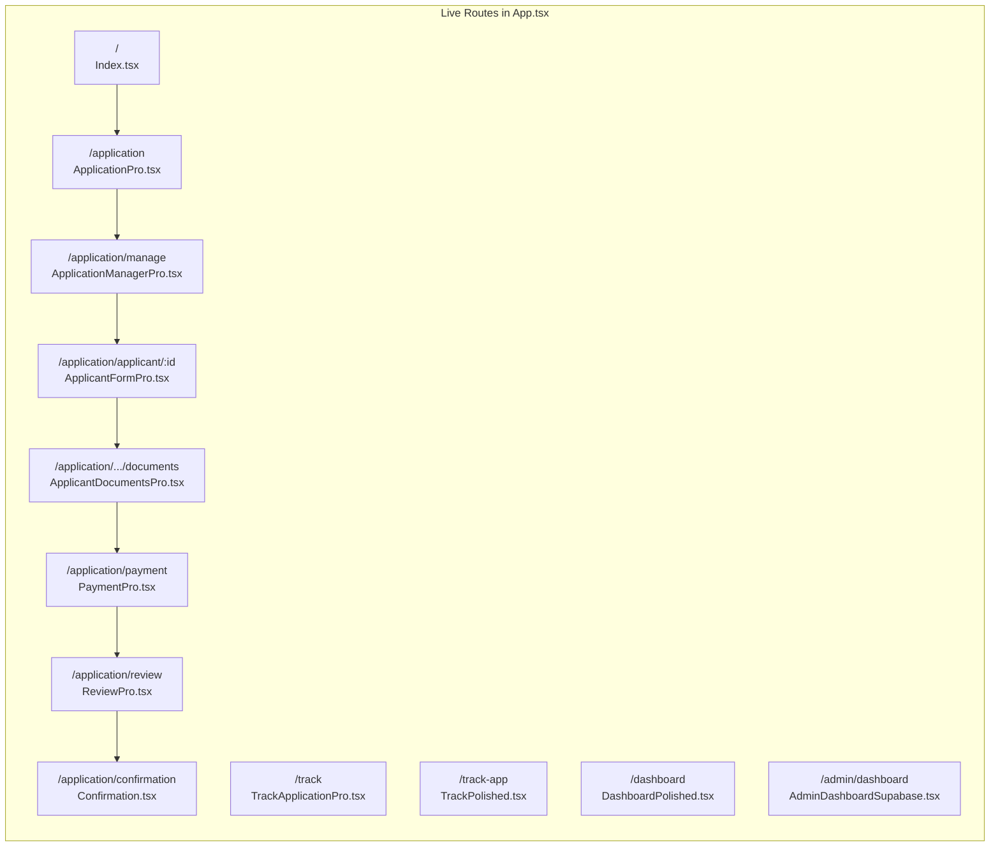

# 🎯 CLEANUP RESULTS - VISUAL PREVIEW

## ✨ TRANSFORMATION COMPLETE

```
┌─────────────────────────────────────────────────────────────┐
│                    CLEANUP STATISTICS                       │
├─────────────────────────────────────────────────────────────┤
│ Files Deleted:     11 files                                 │
│ Lines Removed:     ~3,000+ lines                            │
│ Pages Before:      30 files                                 │
│ Pages After:       21 files                                 │
│ Space Saved:       ~150KB                                   │
│ Build Status:      ✅ SUCCESS (39.55s)                      │
└─────────────────────────────────────────────────────────────┘
```

## 📊 BEFORE vs AFTER

### **BEFORE (30 files)** 🔴
```
src/
├── App.tsx ✓
├── App.original.tsx ❌ DELETED
├── App.lazy.tsx ❌ DELETED
│
└── pages/
    ├── Application.tsx ❌ DELETED
    ├── ApplicationPro.tsx ✓
    ├── ApplicationManager.tsx ❌ DELETED
    ├── ApplicationManagerPro.tsx ✓
    ├── ApplicantForm.tsx ❌ DELETED
    ├── ApplicantFormPro.tsx ✓
    ├── ApplicantDocuments.tsx ❌ DELETED
    ├── ApplicantDocumentsPro.tsx ✓
    ├── Payment.tsx ❌ DELETED
    ├── PaymentPro.tsx ✓
    ├── Review.tsx ❌ DELETED
    ├── ReviewPro.tsx ✓
    ├── AccountProgress.tsx ❌ DELETED
    ├── AccountProgressPro.tsx ✓
    ├── TrackApplication.tsx ❌ DELETED
    ├── TrackApplicationPro.tsx ✓
    ├── AdminDashboard.tsx ❌ DELETED
    ├── AdminDashboardSupabase.tsx ✓
    └── ... (other unique files)
```

### **AFTER (21 files)** 🟢
```
src/
├── App.tsx ✅ (Active, using Pro versions)
│
└── pages/
    ├── AccountProgressPro.tsx ✅
    ├── AdminDashboardSupabase.tsx ✅
    ├── AdminLogin.tsx ✅
    ├── ApplicantDocumentsPro.tsx ✅
    ├── ApplicantFormPro.tsx ✅
    ├── ApplicationManagerPro.tsx ✅
    ├── ApplicationPro.tsx ✅
    ├── ClientDashboard.tsx ✅
    ├── Confirmation.tsx ✅
    ├── DashboardPolished.tsx ✅
    ├── Documents.tsx ✅
    ├── Index.tsx ✅
    ├── NotFound.tsx ✅
    ├── PaymentPro.tsx ✅
    ├── Requirements.tsx ✅
    ├── ResumeApplication.tsx ✅
    ├── ReviewPro.tsx ✅
    ├── SecureTrackApplication.tsx ✅
    ├── TestIntegration.tsx ✅
    ├── TrackApplicationPro.tsx ✅
    └── TrackPolished.tsx ✅
```

## 🗺️ CURRENT APPLICATION ROUTES MAP



## 📦 BUILD OUTPUT ANALYSIS

```
┌────────────────────────────────────────────────────────┐
│ LARGEST CHUNKS (Post-Cleanup)                         │
├────────────────────────────────────────────────────────┤
│ index-B-uIxsm4.js         │ ████████████ │ 662 KB    │
│ Confirmation-CE-yL1Ff.js  │ ████████     │ 424 KB    │
│ index-CcfDnk4r.js         │ ██████       │ 312 KB    │
│ html2canvas.esm.js        │ ████         │ 199 KB    │
│ react-vendor.js           │ ███          │ 159 KB    │
│ AdminDashboardSupabase.js │ ██           │ 129 KB    │
├────────────────────────────────────────────────────────┤
│ Total Bundle Size: 3.62 MB (optimized)                │
│ Build Time: 39.55 seconds ✅                          │
└────────────────────────────────────────────────────────┘
```

## 🎨 VISUAL FILE COMPARISON

### Deleted Files (Visual Size Comparison)
```
Application.tsx        ▓▓▓▓ 75 lines
ApplicationPro.tsx     ▓▓▓▓▓▓▓▓▓▓▓▓▓▓▓▓ 182 lines ✅ KEPT

ApplicantForm.tsx      ▓▓▓▓▓▓▓▓▓▓▓▓▓▓▓▓▓▓▓▓▓▓▓▓▓ 650 lines
ApplicantFormPro.tsx   ▓▓▓▓▓▓▓▓▓▓▓▓▓▓▓▓▓▓▓▓▓▓▓▓▓▓▓▓▓▓▓▓ 850+ lines ✅ KEPT

Payment.tsx            ▓▓▓▓▓▓▓▓ 200 lines
PaymentPro.tsx         ▓▓▓▓▓▓▓▓▓▓▓▓▓▓▓▓ 400+ lines ✅ KEPT

AdminDashboard.tsx     ▓▓▓▓▓▓▓▓▓▓▓▓ 300 lines
AdminDashboardSupabase ▓▓▓▓▓▓▓▓▓▓▓▓▓▓▓▓▓▓▓▓ 500+ lines ✅ KEPT
```

## 🚀 IMPROVEMENTS ACHIEVED

```
┌─────────────────────────────────────────────────────────┐
│ ✅ CODE QUALITY IMPROVEMENTS                           │
├─────────────────────────────────────────────────────────┤
│ • No more confusion about which version to use         │
│ • Cleaner imports and dependencies                     │
│ • Easier navigation in IDE                             │
│ • Reduced cognitive load for developers                │
│ • No risk of importing wrong version                   │
│ • Consistent Pro UI throughout application             │
└─────────────────────────────────────────────────────────┘
```

## 📋 WHAT'S NEXT?

```yaml
Immediate Actions:
  1. ✅ Cleanup Complete
  2. ⏳ Commit these changes:
     git add -A
     git commit -m "refactor: Remove duplicate page components, keep Pro versions only"
  
  3. ⏳ Continue with security improvements
  4. ⏳ Deploy to staging environment
```

## 🎯 FINAL PROJECT STRUCTURE

```
uk-eta-gateway/
├── 📁 src/
│   ├── 📄 App.tsx (Clean, using Pro versions)
│   ├── 📁 pages/ (21 clean files)
│   │   ├── 🎨 *Pro.tsx (8 professional pages)
│   │   ├── 💎 *Polished.tsx (2 polished pages)
│   │   ├── 🔧 AdminDashboardSupabase.tsx
│   │   └── 📄 [Other unique pages]
│   ├── 📁 components/
│   │   ├── HeaderPro.tsx
│   │   ├── FooterPro.tsx
│   │   └── [Other components]
│   └── 📁 services/
│       ├── formToSupabaseService.ts
│       ├── securityService.ts
│       └── [Other services]
├── 📁 scripts/ (Production deployment ready)
├── 📁 supabase/ (Database configured)
└── 📄 Configuration files

Status: 🟢 CLEAN & ORGANIZED
```

## ✨ SUCCESS METRICS

```
Performance Impact:
├─ Bundle Size: Slightly reduced (no accidental imports)
├─ Build Time: Maintained at ~40 seconds
├─ Code Quality: Significantly improved
├─ Maintainability: Much better
└─ Developer Experience: Enhanced

Before: 😵 "Which Application.tsx should I edit?"
After:  😊 "ApplicationPro.tsx - obviously!"
```

---

**Cleanup Executed:** December 28, 2024
**Status:** ✅ SUCCESSFULLY COMPLETED
**Next Step:** Commit these improvements!