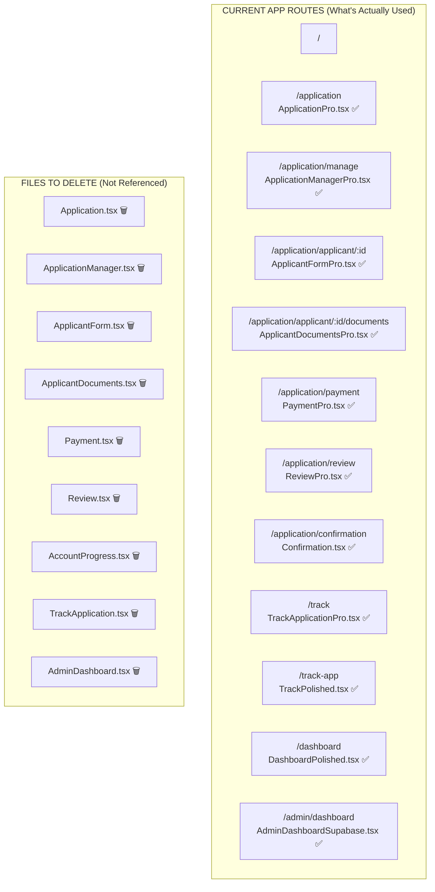

# 🧹 CLEANUP VISUAL GUIDE - UK ETA Gateway

## 📁 CURRENT FILE STRUCTURE & CLEANUP PLAN

```
src/
├── App.tsx ✅ KEEP (Active main file)
├── App.original.tsx 🗑️ DELETE (Old backup)
├── App.lazy.tsx 🗑️ DELETE (Old backup)
│
└── pages/
    │
    ├── ✅ KEEP THESE (Active Pro/Polished versions)
    │   ├── ApplicationPro.tsx ✅
    │   ├── ApplicationManagerPro.tsx ✅
    │   ├── ApplicantFormPro.tsx ✅
    │   ├── ApplicantDocumentsPro.tsx ✅
    │   ├── PaymentPro.tsx ✅
    │   ├── ReviewPro.tsx ✅
    │   ├── AccountProgressPro.tsx ✅
    │   ├── TrackApplicationPro.tsx ✅
    │   ├── AdminDashboardSupabase.tsx ✅
    │   ├── TrackPolished.tsx ✅
    │   └── DashboardPolished.tsx ✅
    │
    ├── 🗑️ DELETE THESE (Replaced by Pro versions)
    │   ├── Application.tsx 🗑️ → Using ApplicationPro.tsx
    │   ├── ApplicationManager.tsx 🗑️ → Using ApplicationManagerPro.tsx
    │   ├── ApplicantForm.tsx 🗑️ → Using ApplicantFormPro.tsx
    │   ├── ApplicantDocuments.tsx 🗑️ → Using ApplicantDocumentsPro.tsx
    │   ├── Payment.tsx 🗑️ → Using PaymentPro.tsx
    │   ├── Review.tsx 🗑️ → Using ReviewPro.tsx
    │   ├── AccountProgress.tsx 🗑️ → Using AccountProgressPro.tsx
    │   ├── TrackApplication.tsx 🗑️ → Using TrackApplicationPro.tsx
    │   └── AdminDashboard.tsx 🗑️ → Using AdminDashboardSupabase.tsx
    │
    └── ✅ KEEP THESE (No duplicates/Special purpose)
        ├── Index.tsx ✅ (Landing page)
        ├── Confirmation.tsx ✅ (Unique)
        ├── ResumeApplication.tsx ✅ (Unique)
        ├── AdminLogin.tsx ✅ (Unique)
        ├── Requirements.tsx ✅ (Unique)
        ├── TestIntegration.tsx ✅ (Testing)
        ├── NotFound.tsx ✅ (404 page)
        ├── Documents.tsx ⚠️ (Check if needed)
        ├── ClientDashboard.tsx ⚠️ (Check if needed)
        └── SecureTrackApplication.tsx ⚠️ (Check if needed)
```

## 🎯 VISUAL FLOW DIAGRAM



## 📊 SIZE COMPARISON

```
┌─────────────────────────────────────────────────────────┐
│ FILE SIZE COMPARISON                                    │
├─────────────────────────────────────────────────────────┤
│                                                          │
│ Application.tsx        ████ 75 lines      🗑️ DELETE    │
│ ApplicationPro.tsx     ████████████ 182 lines ✅ KEEP   │
│                                                          │
│ ApplicantForm.tsx      ██████ 650 lines   🗑️ DELETE    │
│ ApplicantFormPro.tsx   ████████████ 850+ lines ✅ KEEP  │
│                                                          │
│ Payment.tsx            █████ 200 lines    🗑️ DELETE    │
│ PaymentPro.tsx         ██████████ 400+ lines ✅ KEEP    │
│                                                          │
│ = More features, better UI, professional polish         │
└─────────────────────────────────────────────────────────┘
```

## 🔄 IMPORT REFERENCES

```javascript
// src/App.tsx (CURRENT - What's being used)
import Application from "./pages/ApplicationPro";        ✅
import ApplicationManager from "./pages/ApplicationManagerPro"; ✅
import ApplicantForm from "./pages/ApplicantFormPro";    ✅
// ... all using Pro versions

// src/App.original.tsx (TO DELETE)
import Application from "./pages/Application";           ❌
import ApplicationManager from "./pages/ApplicationManager"; ❌
// ... using old non-Pro versions
```

## 🚦 DELETION SAFETY LEVELS

### 🟢 **SAFE TO DELETE** (Confidence: 100%)
- All non-Pro page versions
- App.original.tsx
- App.lazy.tsx

### 🟡 **CHECK BEFORE DELETING** (Confidence: 80%)
- Documents.tsx (no imports found, but check if needed)
- ClientDashboard.tsx (different from DashboardPolished)
- SecureTrackApplication.tsx (might have security features)

### 🔴 **DO NOT DELETE** (Critical files)
- All Pro versions
- All unique pages (Index, Confirmation, etc.)
- All components in /components folder

## 📋 CLEANUP COMMANDS

```bash
# Step 1: Create safety backup
git checkout -b cleanup-backup
git add -A && git commit -m "Backup before cleanup"

# Step 2: Delete backup App files
rm src/App.original.tsx src/App.lazy.tsx

# Step 3: Delete replaced page versions
rm src/pages/Application.tsx
rm src/pages/ApplicationManager.tsx
rm src/pages/ApplicantForm.tsx
rm src/pages/ApplicantDocuments.tsx
rm src/pages/Payment.tsx
rm src/pages/Review.tsx
rm src/pages/AccountProgress.tsx
rm src/pages/TrackApplication.tsx
rm src/pages/AdminDashboard.tsx

# Step 4: Verify everything still works
npm run dev
npm run build

# Step 5: If all good, commit
git add -A && git commit -m "Clean up duplicate page versions - using Pro versions only"
```

## ✅ FINAL STATE AFTER CLEANUP

```
src/pages/ (21 files → 12 files)
├── AccountProgressPro.tsx ✅
├── AdminDashboardSupabase.tsx ✅
├── AdminLogin.tsx ✅
├── ApplicantDocumentsPro.tsx ✅
├── ApplicantFormPro.tsx ✅
├── ApplicationManagerPro.tsx ✅
├── ApplicationPro.tsx ✅
├── Confirmation.tsx ✅
├── DashboardPolished.tsx ✅
├── Index.tsx ✅
├── NotFound.tsx ✅
├── PaymentPro.tsx ✅
├── Requirements.tsx ✅
├── ResumeApplication.tsx ✅
├── ReviewPro.tsx ✅
├── TestIntegration.tsx ✅
├── TrackApplicationPro.tsx ✅
└── TrackPolished.tsx ✅

Plus maybe:
├── Documents.tsx ⚠️
├── ClientDashboard.tsx ⚠️
└── SecureTrackApplication.tsx ⚠️
```

## 💾 SPACE SAVED

**Estimated cleanup impact:**
- **Files removed:** 11 files
- **Lines removed:** ~3,000+ lines of duplicate code
- **Bundle size:** Potentially smaller (no accidental imports)
- **Maintenance:** Much easier with single versions

---

**Generated:** August 28, 2025