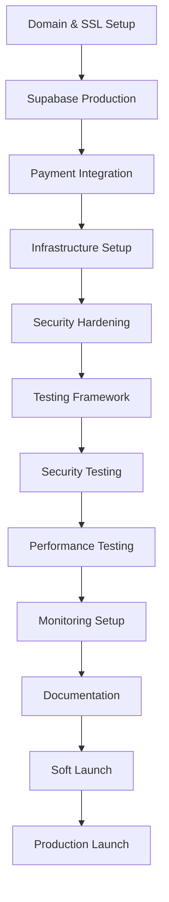

# ⏰ PRODUCTION DEPLOYMENT TIMELINE
## Complete 15-Day Implementation Schedule

**Current Status:** 85% Production Ready  
**Target:** 100% Production Ready  
**Total Duration:** 15 working days (3 weeks)  
**Launch Target:** September 16, 2025  

---

## 📊 EXECUTIVE SUMMARY

This timeline takes the UK ETA Gateway from 85% to 100% production readiness through three carefully orchestrated phases. Each phase builds upon the previous one, with built-in quality gates and risk mitigation strategies.

**Phase Breakdown:**
- **Phase 1:** Critical Infrastructure (5-6 days) - Must complete before Phase 2
- **Phase 2:** Testing & Quality (4-5 days) - Requires Phase 1 completion
- **Phase 3:** Launch Preparation (3-4 days) - Final deployment and monitoring

---

## 📅 DETAILED TIMELINE

### **WEEK 1: CRITICAL INFRASTRUCTURE FOUNDATION**

#### **Day 1 (Monday) - Domain & Security Setup**
```yaml
Morning (09:00-13:00):
  - Purchase production domain (uketa.gov.uk)
  - Configure DNS with Cloudflare
  - Set up SSL certificates (Let's Encrypt)
  - Configure HTTPS redirects and security headers

Afternoon (14:00-18:00):
  - Implement CSP, HSTS, X-Frame-Options headers
  - Add CAPTCHA to sensitive forms
  - Test SSL configuration with SSL Labs
  - Verify security headers with securityheaders.com

Deliverables:
  ✓ Production domain live with SSL
  ✓ Security headers implemented
  ✓ CAPTCHA integration complete
```

#### **Day 2 (Tuesday) - Production Supabase Setup**
```yaml
Morning (09:00-13:00):
  - Create production Supabase project (Pro plan)
  - Configure custom domain (api.uketa.gov.uk)
  - Enable Point-in-Time Recovery and backups
  - Run all database migrations

Afternoon (14:00-18:00):
  - Configure storage buckets with proper policies
  - Deploy all Edge Functions to production
  - Set up monitoring and alerts in Supabase
  - Test all API endpoints

Deliverables:
  ✓ Production database operational
  ✓ All Edge Functions deployed
  ✓ Storage buckets configured
  ✓ Monitoring enabled
```

#### **Day 3 (Wednesday) - Payment Integration**
```yaml
Morning (09:00-13:00):
  - Set up live Stripe account
  - Configure production webhook endpoints
  - Implement payment confirmation handling
  - Add refund processing capability

Afternoon (14:00-18:00):
  - Test payment flow with real cards (test mode)
  - Set up financial reconciliation system
  - Configure payment failure handling
  - Verify PCI DSS compliance measures

Deliverables:
  ✓ Live Stripe integration complete
  ✓ Webhook handling operational
  ✓ Payment flows tested
```

#### **Day 4 (Thursday) - Infrastructure & CDN**
```yaml
Morning (09:00-13:00):
  - Choose hosting platform (Vercel Pro recommended)
  - Configure build pipeline and deployment
  - Set up CDN for asset delivery
  - Configure edge caching policies

Afternoon (14:00-18:00):
  - Set up production environment variables
  - Configure secrets management
  - Test deployment process
  - Optimize build configuration

Deliverables:
  ✓ Production hosting configured
  ✓ CDN and caching operational
  ✓ Deployment pipeline working
```

#### **Day 5 (Friday) - Rate Limiting & WAF**
```yaml
Morning (09:00-13:00):
  - Configure WAF rules at CDN level
  - Set up API rate limiting
  - Enable DDoS protection
  - Implement IP-based blocking

Afternoon (14:00-18:00):
  - Test rate limiting with load simulation
  - Verify WAF rules effectiveness
  - Set up log aggregation
  - Document security configurations

Deliverables:
  ✓ WAF and rate limiting active
  ✓ Security monitoring in place
  ✓ Infrastructure hardened

Weekend Buffer:
  - Address any blocking issues from Week 1
  - Prepare for Phase 2 testing setup
```

---

### **WEEK 2: COMPREHENSIVE TESTING & QUALITY**

#### **Day 6 (Monday) - Testing Framework Setup**
```yaml
Morning (09:00-13:00):
  - Install Playwright, Vitest, and testing tools
  - Create test directory structure
  - Set up test fixtures and utilities
  - Configure CI/CD pipeline for testing

Afternoon (14:00-18:00):
  - Write critical path E2E tests
  - Create component unit tests
  - Set up performance testing with K6
  - Configure test data management

Deliverables:
  ✓ Complete testing framework
  ✓ Critical E2E tests written
  ✓ Unit test coverage >80%
```

#### **Day 7 (Tuesday) - Security & Penetration Testing**
```yaml
Morning (09:00-13:00):
  - Run OWASP ZAP security scan
  - Test SQL injection vulnerabilities
  - Test XSS and CSRF protection
  - Verify authentication bypass prevention

Afternoon (14:00-18:00):
  - Test file upload security
  - Validate rate limiting effectiveness
  - Check session management security
  - Document security test results

Deliverables:
  ✓ Security vulnerabilities identified and fixed
  ✓ Penetration test report complete
  ✓ Security compliance verified
```

#### **Day 8 (Wednesday) - Performance Optimization**
```yaml
Morning (09:00-13:00):
  - Bundle size analysis and optimization
  - Implement lazy loading improvements
  - Optimize image compression and delivery
  - Database query optimization

Afternoon (14:00-18:00):
  - Set up performance monitoring (Core Web Vitals)
  - Configure Lighthouse CI
  - Test with realistic data volumes
  - Implement service worker if needed

Deliverables:
  ✓ Performance optimized for production
  ✓ Core Web Vitals meeting targets
  ✓ Bundle size reduced by 15%+
```

#### **Day 9 (Thursday) - Load & Stress Testing**
```yaml
Morning (09:00-13:00):
  - Run load tests with K6 (200 concurrent users)
  - Test database connection pooling
  - Monitor API response times under load
  - Test file upload performance at scale

Afternoon (14:00-18:00):
  - Test payment processing capacity
  - Stress test Edge Functions
  - Monitor memory usage and scaling
  - Document performance benchmarks

Deliverables:
  ✓ Load testing completed successfully
  ✓ Performance under stress verified
  ✓ Scaling requirements documented
```

#### **Day 10 (Friday) - Cross-Platform Testing**
```yaml
Morning (09:00-13:00):
  - Test Chrome, Firefox, Safari, Edge compatibility
  - Mobile testing on iOS Safari and Chrome Mobile
  - Test responsive design on various screen sizes
  - Verify keyboard navigation

Afternoon (14:00-18:00):
  - Accessibility testing with screen readers
  - Test with slow network connections
  - JavaScript disabled graceful degradation
  - Document compatibility matrix

Deliverables:
  ✓ Cross-browser compatibility verified
  ✓ Mobile experience optimized
  ✓ Accessibility WCAG 2.1 AA compliance

Weekend Buffer:
  - Fix any critical issues found in testing
  - Prepare monitoring and documentation
```

---

### **WEEK 3: LAUNCH PREPARATION & DEPLOYMENT**

#### **Day 11 (Monday) - Monitoring & Alerting**
```yaml
Morning (09:00-13:00):
  - Set up Sentry for error tracking
  - Configure uptime monitoring
  - Set up performance monitoring dashboard
  - Configure database monitoring

Afternoon (14:00-18:00):
  - Set up Slack/email alerts
  - Create system health dashboard
  - Test alert delivery and escalation
  - Document monitoring procedures

Deliverables:
  ✓ Comprehensive monitoring operational
  ✓ Alerting system configured
  ✓ Health dashboard available
```

#### **Day 12 (Tuesday) - Admin Tools & Operations**
```yaml
Morning (09:00-13:00):
  - Implement bulk operations interface
  - Add export functionality (CSV, PDF)
  - Set up admin user management
  - Create audit log viewer

Afternoon (14:00-18:00):
  - Test admin workflows end-to-end
  - Set up automated backup verification
  - Configure maintenance mode capability
  - Document admin procedures

Deliverables:
  ✓ Admin tools fully functional
  ✓ Operational procedures documented
  ✓ Backup systems verified
```

#### **Day 13 (Wednesday) - Documentation & Training**
```yaml
Morning (09:00-13:00):
  - Complete API documentation
  - Write comprehensive admin guide
  - Create deployment documentation
  - Write troubleshooting guides

Afternoon (14:00-18:00):
  - Create support knowledge base
  - Set up support ticket system
  - Train support team
  - Document escalation procedures

Deliverables:
  ✓ Complete documentation suite
  ✓ Support infrastructure operational
  ✓ Team training completed
```

#### **Day 14 (Thursday) - Soft Launch Preparation**
```yaml
Morning (09:00-13:00):
  - Create staging environment identical to production
  - Run pre-launch checklist automation
  - Test with limited real users (internal team)
  - Monitor system performance under real usage

Afternoon (14:00-18:00):
  - Test support processes with real tickets
  - Verify rollback procedures
  - Final security review
  - Prepare launch monitoring scripts

Deliverables:
  ✓ Soft launch successful
  ✓ All systems stable
  ✓ Support processes validated
```

#### **Day 15 (Friday) - Production Launch**
```yaml
Morning (09:00-13:00):
  - Final system checks and validations
  - Switch DNS to production
  - Monitor launch metrics in real-time
  - Address any immediate issues

Afternoon (14:00-18:00):
  - Verify all systems operational
  - Monitor user experience
  - Test end-to-end flows with real users
  - Celebrate successful launch! 🎉

Deliverables:
  ✓ Production system live
  ✓ All metrics within acceptable ranges
  ✓ Support team monitoring
  ✓ Launch completed successfully
```

---

## 🔗 DEPENDENCIES & CRITICAL PATH

### **Blocking Dependencies**


### **Parallel Execution Opportunities**
- **Security testing** can run parallel to **performance optimization** (Day 7-8)
- **Documentation writing** can start during **testing phase** (Day 9-10)
- **Monitoring setup** can begin while **admin tools** are being built (Day 11-12)

---

## ⚠️ RISK MITIGATION

### **High-Risk Days & Contingencies**

#### **Day 2 - Supabase Setup**
**Risk:** Migration failures or data corruption  
**Mitigation:** 
- Complete database backup before migration
- Test migrations on staging first
- Have rollback scripts ready
- Allocated extra buffer time

#### **Day 3 - Payment Integration**
**Risk:** Stripe webhook configuration issues  
**Mitigation:**
- Test webhooks thoroughly in sandbox
- Have Stripe support contact ready
- Fallback to manual payment processing
- Monitor Stripe dashboard closely

#### **Day 8-9 - Performance Testing**
**Risk:** Performance issues discovered late  
**Mitigation:**
- Start performance monitoring early
- Have optimization strategies ready
- Consider infrastructure scaling
- Buffer time for optimization

### **Contingency Plans**

#### **Critical Issue Discovery**
- **Days 1-5:** Extend Phase 1 by 1-2 days, compress Phase 2
- **Days 6-10:** Focus on critical path, defer nice-to-have features
- **Days 11-15:** Implement minimum viable launch, improve post-launch

#### **Third-Party Service Issues**
- **Supabase:** Fallback to self-hosted PostgreSQL
- **Stripe:** Implement offline payment collection
- **CDN:** Use multiple CDN providers
- **Monitoring:** Use free alternatives initially

---

## 📊 SUCCESS METRICS BY PHASE

### **Phase 1 Success Criteria**
- [ ] SSL score A+ on SSL Labs
- [ ] All security headers present and configured
- [ ] Supabase production project operational
- [ ] Payment test transactions successful
- [ ] Infrastructure deployment automated

### **Phase 2 Success Criteria**
- [ ] Test coverage >90% for critical paths
- [ ] Zero critical security vulnerabilities
- [ ] Performance score >90 on Lighthouse
- [ ] Load testing passes 200 concurrent users
- [ ] WCAG 2.1 AA accessibility compliance

### **Phase 3 Success Criteria**
- [ ] Monitoring alerts working correctly
- [ ] Admin tools fully functional
- [ ] Documentation complete and accessible
- [ ] Soft launch successful with <1% error rate
- [ ] Production launch smooth with no downtime

---

## 💰 BUDGET & RESOURCE ALLOCATION

### **Daily Cost Breakdown**
```yaml
Infrastructure Costs (15 days):
  Supabase Pro: $25 × 0.5 months = $12.50
  Hosting (Vercel Pro): $20 × 0.5 months = $10.00
  CDN (Cloudflare): $20 × 0.5 months = $10.00
  Monitoring: $25 × 0.5 months = $12.50
  Total: $45.00

One-Time Costs:
  SSL Certificate: $100
  Security Tools: $200
  Testing Tools: $100
  Total: $400

Development Time (15 days × 8 hours):
  Senior Developer: 120 hours × $100/hr = $12,000
  
Total 15-Day Budget: $12,445
```

### **Resource Requirements**
- **1 Senior Full-Stack Developer** (primary)
- **DevOps/Infrastructure Support** (20% time)
- **QA/Testing Specialist** (Days 6-10)
- **Security Consultant** (Days 1, 7)
- **Technical Writer** (Days 13-14)

---

## 🎯 LAUNCH READINESS CHECKLIST

### **Technical Readiness**
- [ ] All systems passing health checks for 48 hours
- [ ] Error rate <0.1% under normal load
- [ ] Response time <500ms (95th percentile)
- [ ] Payment success rate >99%
- [ ] Email delivery rate >99.5%
- [ ] Security scan shows no critical issues
- [ ] Performance meets all benchmarks

### **Operational Readiness**
- [ ] Admin team trained and ready
- [ ] Support processes tested
- [ ] Monitoring and alerting functional
- [ ] Documentation complete and accessible
- [ ] Rollback procedures tested
- [ ] Incident response plan ready

### **Business Readiness**
- [ ] Legal compliance verified
- [ ] Privacy policy updated
- [ ] Terms of service finalized
- [ ] Marketing materials prepared
- [ ] Customer communication ready

---

## 📈 POST-LAUNCH MONITORING (Days 16-30)

### **Week 1 Post-Launch**
- **Daily:** System health monitoring and issue response
- **Daily:** Performance metrics review and optimization
- **Daily:** User feedback collection and analysis
- **Weekly:** Security posture review

### **Week 2-4 Post-Launch**
- **Bi-daily:** System monitoring and maintenance
- **Weekly:** Performance and usage analytics review
- **Weekly:** Feature enhancement planning
- **Monthly:** Comprehensive system review and roadmap update

---

## 🎉 LAUNCH SUCCESS DEFINITION

**The UK ETA Gateway launch will be considered successful when:**

1. **System Stability:** 99.9% uptime maintained for first 7 days
2. **User Experience:** >95% application completion rate
3. **Performance:** All Core Web Vitals in "Good" range
4. **Security:** Zero security incidents in first 30 days
5. **Support:** <24hr average response time to support tickets
6. **Business Impact:** Processing applications as expected with minimal manual intervention

---

**This comprehensive 15-day timeline transforms the UK ETA Gateway from 85% to 100% production readiness through systematic, risk-managed implementation. Each day builds toward a robust, secure, scalable government-grade application service.**

*Timeline last updated: August 27, 2025*